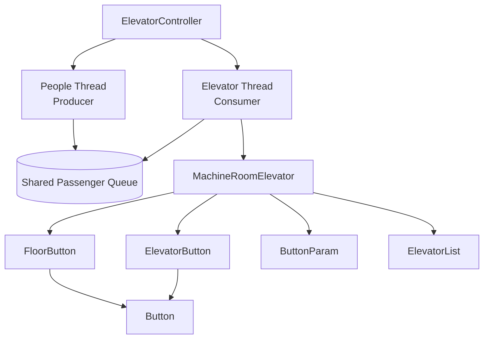
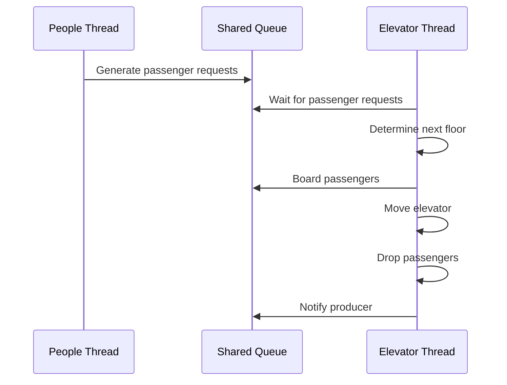
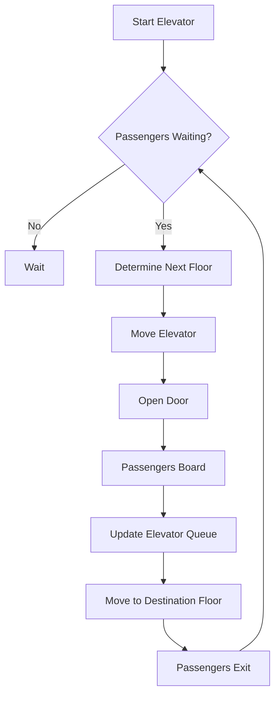

# Elevator Design

A Java-based simulation of an elevator control system built using **Object-Oriented Programming**, **Multithreading**, and the **Producer-Consumer Synchronization Pattern**.

The project simulates how passengers request an elevator, board it, and exit at their destination floor while maintaining synchronization between concurrent threads.

---

# Features

- 🚀 Java Object-Oriented Design
- 🧵 Multithreading
- 🔄 Producer-Consumer Synchronization
- 🚪 Elevator Scheduling Simulation
- 🏢 Floor Request Handling
- 👥 Passenger Queue Management
- ⚖️ Elevator Capacity Management
- 📦 Shared Queue Synchronization using `wait()` and `notify()`

---

# Technologies Used

- Java
- Object-Oriented Programming (OOP)
- Multithreading
- Producer-Consumer Pattern
- Synchronization
- Java Collections Framework

---

# System Architecture 

The system follows a **Producer–Consumer architecture** where the `**People**` thread generates elevator requests, and the `**Elevator**` thread consumes those requests from a synchronized shared queue. The `**MachineRoomElevator**` coordinates elevator movement, passenger boarding, and passenger exit while maintaining the elevator state.

The following diagram illustrates the interaction between the controller, producer thread, consumer thread, shared passenger queue, and elevator subsystem.
<p align="center">
 
</p>


---

# Project Architecture



---

# Producer-Consumer Workflow



---

# Elevator Workflow



---

# Project Structure

```
ElevatorDesign
│
├── ElevatorController.java
├── Elevator.java
├── MachineRoomElevator.java
├── People.java
├── ElevatorPeople.java
├── ElevatorList.java
├── Button.java
├── ButtonParam.java
├── FloorButton.java
├── ElevatorButton.java
└── README.md
```

---

# Core Components

## ElevatorController

Acts as the entry point of the application.

Responsibilities:

- Creates the producer thread.
- Creates the consumer thread.
- Starts both threads.
- Synchronizes thread execution.

---

## People

Represents passengers waiting for the elevator.

Responsibilities:

- Generate passengers.
- Store source floor.
- Store destination floor.
- Store passenger weight.
- Add passengers to the shared queue.

---

## MachineRoomElevator

Core controller of the elevator simulation.

Responsibilities:

- Determine the next floor.
- Move the elevator.
- Board passengers.
- Drop passengers.
- Maintain elevator capacity.
- Manage passengers currently inside the elevator.

---

## Button Hierarchy

```
Button
├── FloorButton
└── ElevatorButton
```

These classes simulate elevator call buttons and destination buttons.

---

## ButtonParam

Stores shared information used by button logic.

Contains:

- Passenger queue
- Elevator list
- Current floor
- Total floors

---

## ElevatorList

Represents passengers currently inside the elevator.

Stores:

- Boarding floor
- Destination floor
- Passenger weight

---

# Design Pattern

This project is based on the **Producer-Consumer Pattern**.

- **Producer:** People Thread
- **Consumer:** Elevator Thread
- **Shared Resource:** Passenger Queue

The producer continuously generates elevator requests, while the consumer processes those requests by moving the elevator, boarding passengers, and dropping them at their destination.

Synchronization is implemented using Java's `wait()` and `notify()` mechanisms to safely coordinate access to the shared queue.

---

# How It Works

1. The `People` thread generates passengers.
2. Passenger requests are added to a synchronized shared queue.
3. The elevator waits until requests become available.
4. The elevator determines the next floor.
5. Passengers board the elevator.
6. The elevator moves to the requested destination.
7. Passengers exit the elevator.
8. The process repeats until no requests remain.

---

# How to Run

1. Clone the repository.

```bash
git clone <repository-url>
```

2. Open the project in your preferred Java IDE.

- IntelliJ IDEA
- Eclipse
- NetBeans

3. Run

```
ElevatorController.java
```

The `ElevatorController` class starts both the producer and consumer threads and launches the elevator simulation.

---

# Learning Outcomes

This project demonstrates practical implementation of:

- Java Multithreading
- Synchronization
- Producer-Consumer Design Pattern
- Object-Oriented Programming
- Concurrent Programming
- Thread Coordination
